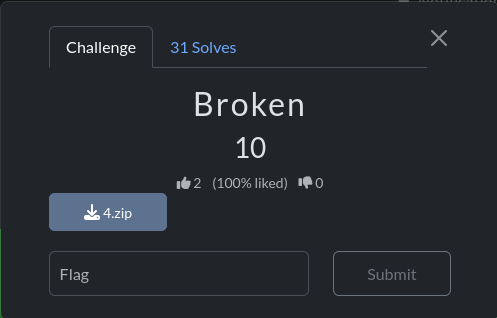

# Broken

## Challenge Description

## Solution

In this challenge, We are given a file which could not be extracted.

I tried to extract using 7z tool, but still got an error

Finally, I used the xxd command to check the header of the file and VOILA!!! The flag was found. Also, yhe file header was not proper. Now I know why I cant open and extract the file.

