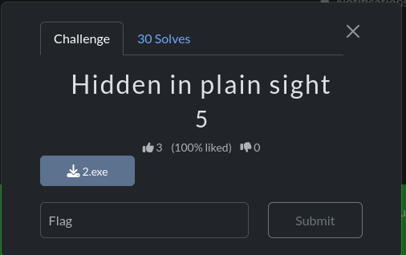
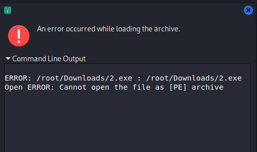
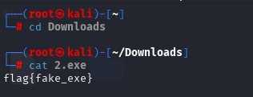

# Hidden in Plainsight

## Challenge Description

## Solution

In this challenge, We are given a .exe file.

I tried to open it, but it gave an archive error, which was strange for an .exe file.

so I went to open the file in terminal to see if it works.

Lucky me, I got the flag!!!!

