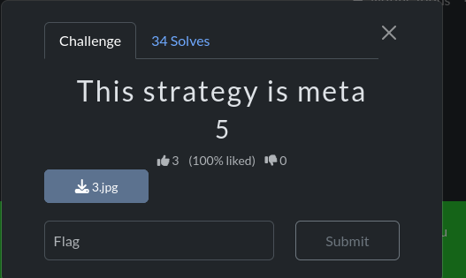

# The Strategy is Meta

## Challenge Description

## Solution

In this challenge, We are given an image.

As we all know, the hint is already in the description : "METADATA"

I went to a file metadata analyzer website and uploaded the image.

The flag was then found in the User comment section

