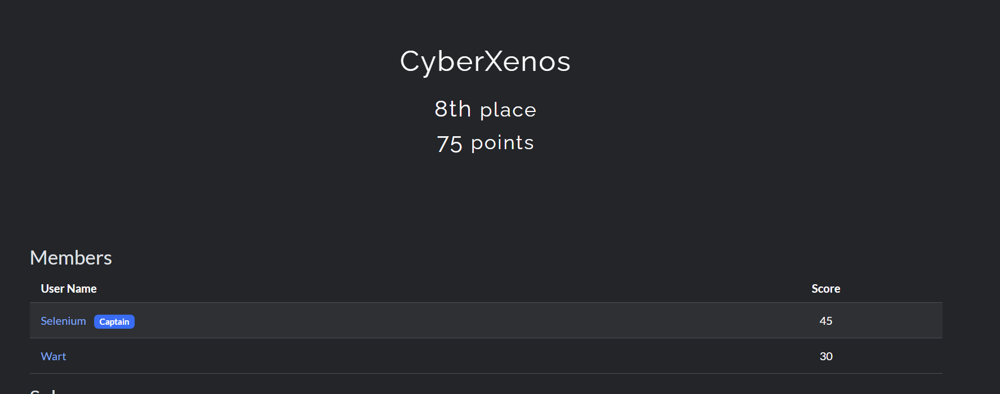
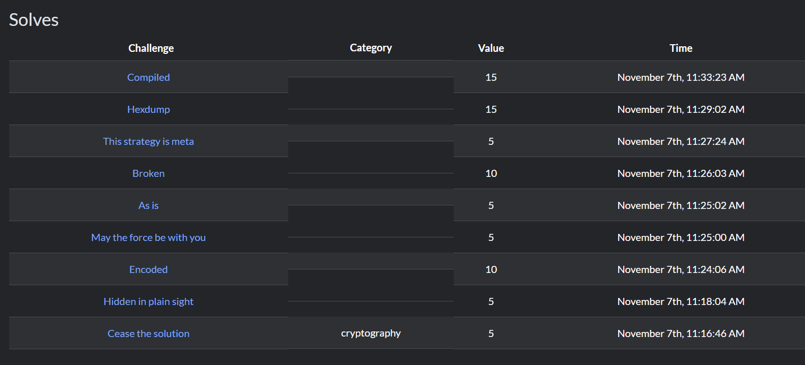

RootQuest is a CTF event which had taken place at Sahyadri College of engineering at Mangalore.

the challenges which this event presented was not a difficult one, its just that i was not exposed to such problems. Also, i had made some dumb decisions that i completely wasted my time solving some problems.

My team managed to come 8th rank in this event out of 37 teams, where each team consisted of 2 members. Well...the experience was good. I liked it.

Now, its time to get exposed more and IMPROVE.!!!!!!!

