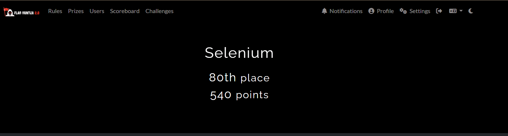
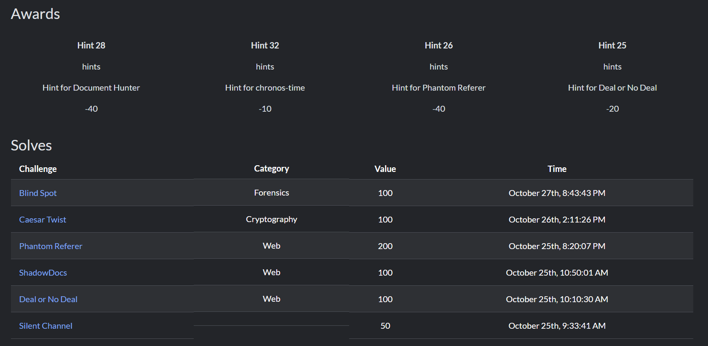
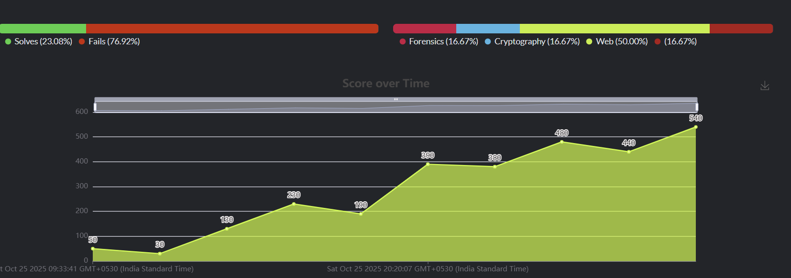

I name Myself Selenium in this competition, just because I had no other creative names and Selenium sounds cool to me.

I participated in Flag Hunter 2.0 which was held on 25th October 2025 to 27th October 2025.

This was my first CTF competition, I never attended any of them until then. 

This was really a good experience and i learned a lot of stuffs in those 2 days than i had in courses and college. I also came to know how CTF competitons are held and got some insights to it. 

I did my best, thats what I believe, based on the amount of knowledge I have till then. I saw other players ranks and scores too, and that gave me a drive to Improve, Adapt and Conquer. 

I feel proud that I came 80th rank. I know its not that worth, but, I felt that i deserved it, being a first timer and being fearless to solve and at least trying to solve. 

With this, I told myself to keep Improving, keep Adapting, and keep Conquering.

If I didnt took those hints, my score would've being 610, putting me at around 70 to 68 ranks. But whatever, I better be more skilled next time.

The Graph shows the scores I gained overtime. As you all can see, its full of ups and downs.

If you read till here, THANKYOU FOR SPENDING YOUR TIME IN MY REPO. REALLY APPRECIATE IT.

