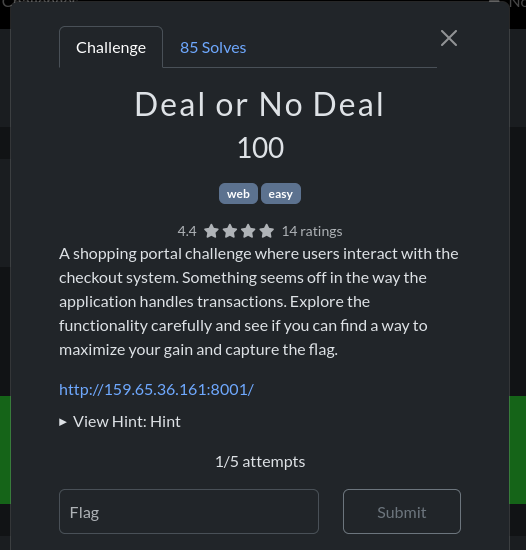
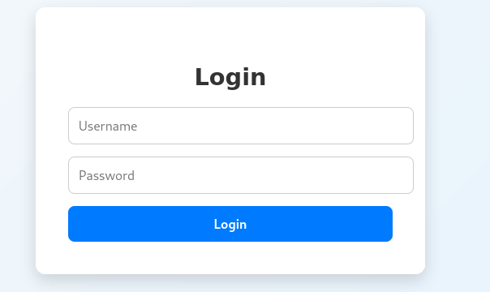
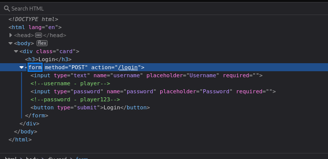

# Deal or No Deal

## Challenge Description

## Solution

In this challenge, We are first greeted with a Login page. As confident as I am, I directly opened the inspector and found the user name and password as comments in the HTML script.

As we logged in, we are presented with a Dashboard with variety of items to shop from. I interacted with each item, and saw the output it gives. 

In File.zip, there were 2 more folders: 
Logs.zip and a README.txt 

The README.txt contains the sentence: FLAGS HAVE BEEN REDACTED AND ARCHIVED, TRY HARDER.

In Logs.zip, there is a syslog.txt file which contains logs of system entries.

The file which grabbed my attention was the Junk.docs. When I clicked on it, a message is displayed saying that the "Archived type is not supported".

I googled on how to open such files and found out that 7z tool can be used to extract and open such files.

Without any hesitation, I fired up my terminal and typed the command:
7z x challenge.zip

The file was automatically extracted and various folders is added on desktop.

Among those folders, there was a Media folder. Upon clicking it, a png file was found , when opened, an image of the flag was displayed.

Since each challenge had 5 attempts, I took the risk and typed the flag in the submit bar.

And thats it, the flag was submitted.

The other folders were like a distraction as most people will go and investigate the folders first. Hence i guessed why the challenge was named as Blind Spot.

