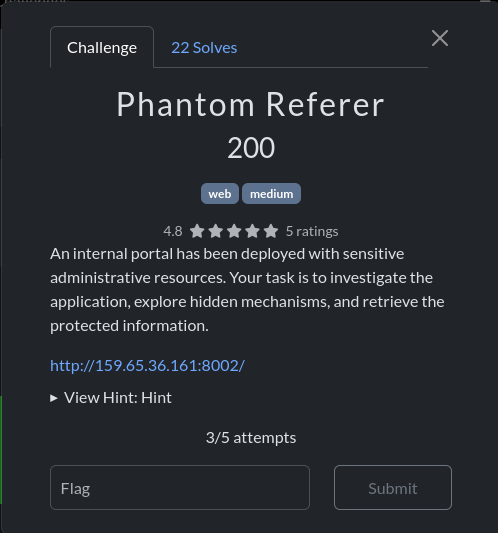
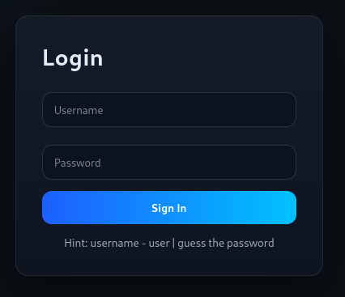
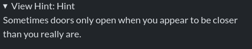
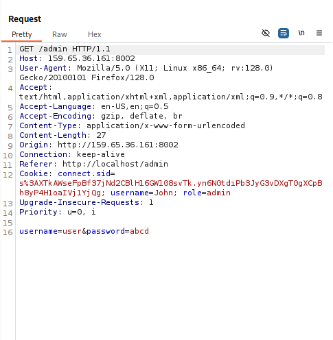

# Phantom Referer

## Challenge Description

## Solution

This was a Medium Level challenge which when solved, rewards 200 points.
The challenge starts with a login page with hints at the bottom of the login box: "username - user | password - guess the password"

So, I tried random passwwords for like 10 times. Starting with admin123 followed by 123456, ADMIN@12345, etc etc. But to no avail.
I then tried to find endpoints. First i tried with /Admin, nothing!!!. Then /Flag, /secret, /hunter etc. I then tried /admin (a is small now) and I got a page saying "403- FORBIDDEN"

I then didnt knew what to do, so i sacrificed my points for the hint. 

The Hint said something about "being closer than where you are", which came to my mind that I should change my IP address in such a way that the server thinks I am operating on their site.

I then googled on how to do that and found out that we can include a request header Referer to change our IP address so that the server thinks I am coming from a localhost. Without any hesitation, I fired up burpsuite, Intercepted the request, and added a Referer header with the value "http//localhost/".

The request is sent, and it worked!!!! we are now in the admin page without proper authorization.

I changed every items discount to 100 and clicked on every item to purchase. When i clicked on the "Golden Cookie", with the discount changed to 100, The flag was displayed.

