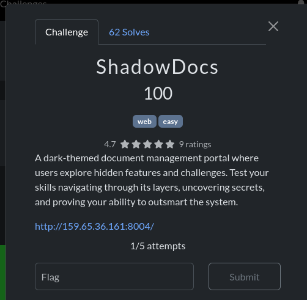
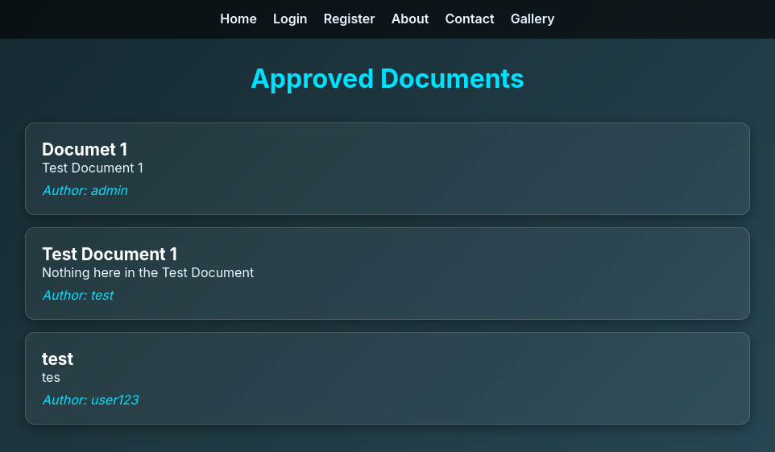
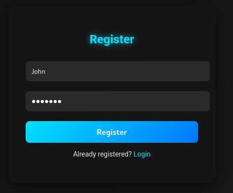
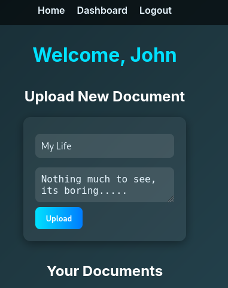
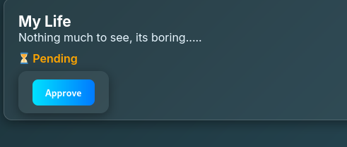
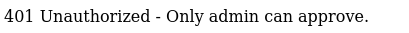
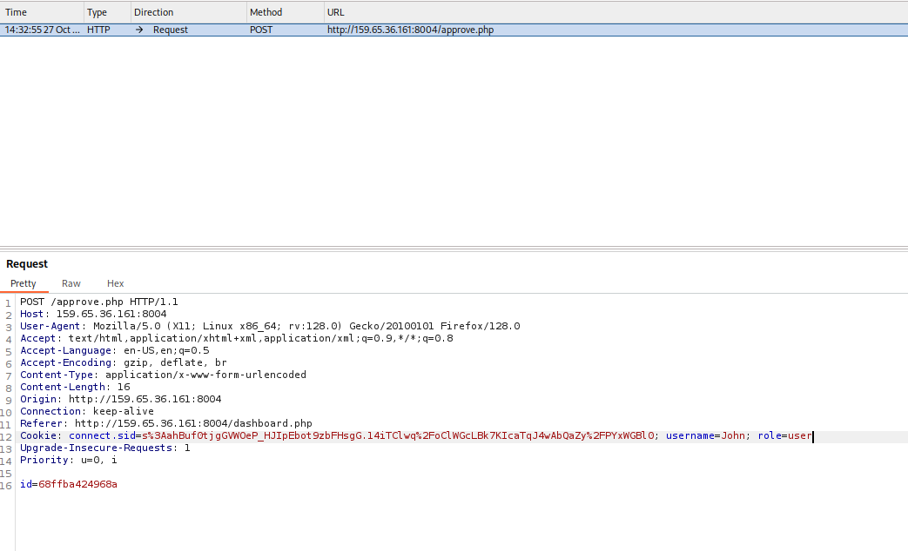
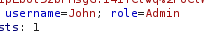
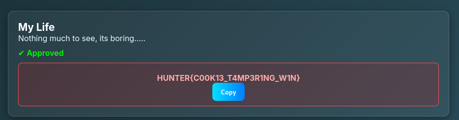

# Shadow Docs

## Challenge Description

## Solution

In this challenge , we are shown a Dashboard with various approved documents. 

I saw the option for register and registered myself as John with some random password.

after doing this, I was redirected to a document upload page with document name and document description. I typed some random things and clicked upload.

A section appeared below the upload section and it has the option to approve. However when i clicked approve, I was shown a page saying that only admins can approve!!! 

I then inspected the cookie and found that my role is "user". So I opened Buirpsuite and modified the request by changing the role to "admin" and then clicked send.

But then, nothing happened, so I just opened the inspector and just changed the cookie instead, and then clicked approve. 

VOILA!!!! The flag is exposed!!!!

